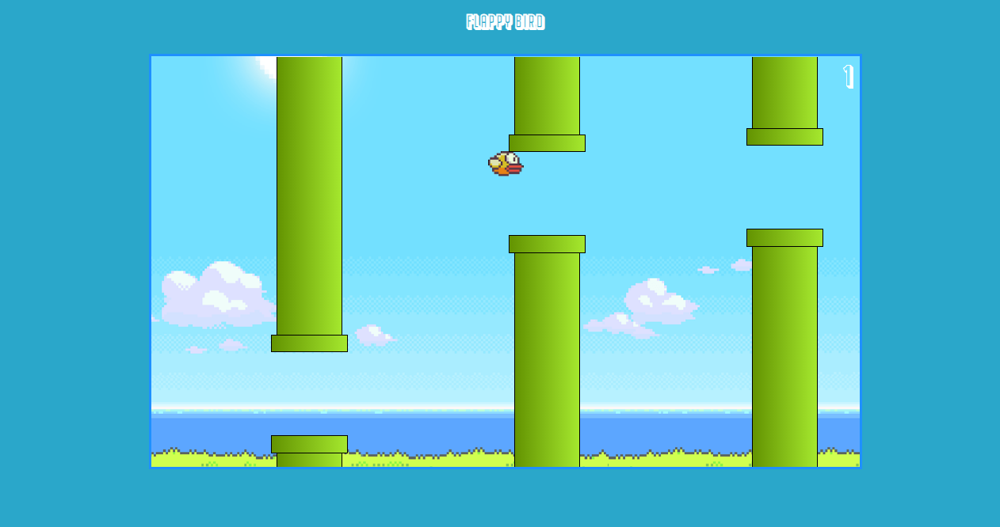

<h1>  </h1>

#  Flappy Bird

<h2 align="center"> Um jogo do Flappy Bird </h2>

# Sobre

 Esse projeto é um clone do video game <strong>Flappy Bird</strong> feito em  <strong>JavaScript</strong> usando a DOM 

 
 

  # Layout

 Disponivel Apenas Para desktop

  <h1>  </h1>
  

  # Tecnologias

 <h3> Tecnologias ultilizadas nesse projeto </h3>

- HTML  
- CSS
- JavaScript
 

  <h2>  Made by <a href="https://www.instagram.com/julius__caezar/">Julius caezar </a></h2>